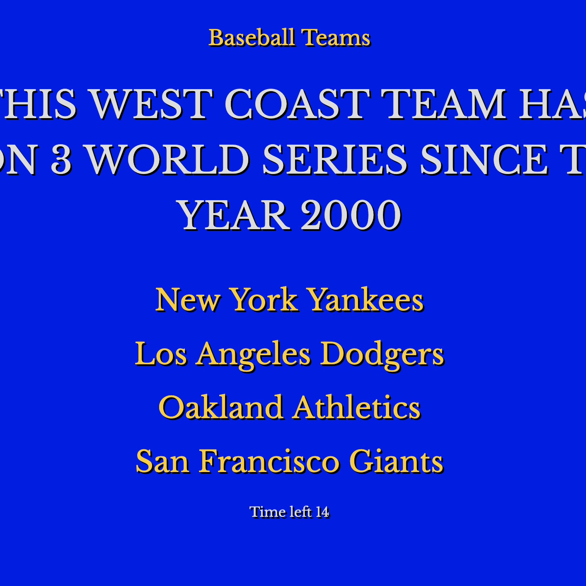

# trivia-game

## Overview
* Trivia game using JavaScript for the logic and jQuery to manipulate HTML. I choose to make tribute to my favourite game show Jeopardy. 

* This trivia game that shows only one question until the player answers it or their time runs out.
If the player selects the correct answer, a congratulations screen is shown. After a few seconds, it displays the next question. 

* The scenario is similar for wrong answers and time-outs.

